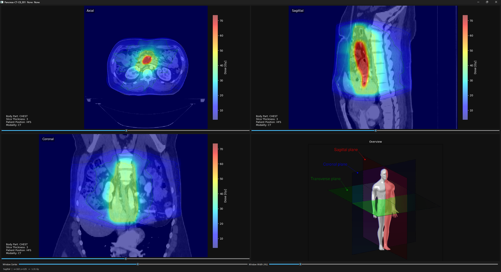

# Projekt2: RT-Viewer

---
## Inhaltsverzeichnis
- [Setup](...)
- [Aufgabenstellung](#aufgabenstellung)
  - [Todo Liste](#todo-liste)
  - [Folie](#folie)
- [Planung](#planung)
  - [Initial](#initial)
  - [Erste Implementierungen](#erste-implementierungen)
- [Shell Commands](#shell-commands)

---
## Setup

```shell
git clone https://github.com/rahelBlub/AMI_Project_RT_Viewer.git
```
Es wurde der **gesamte** RT Datensatz aus dem exterenn Workspace in folgendes Verzeichnis geladen:

````
AMI-Project RT-Viewer\data\RT
````

Als nächstes müssen die requirements.txt installiert werden.

```bash
pip install requirements.txt
```
Mit Starten der `main.py` wird das Programm ausgeführt.

```bash
python main.py
```
Daraufhinn erfolgt eine Auflistung aller Datensätze und eine Abfrage, welcher Patient ausgewählt werden soll. 
Damit ist der Datensatz gemeint.

````
Verfügbare Patienten:

[1] VdQuNEovq74GZdUJixmOfGgV8
[2] LUNG1-001
[3] LUNG1-010
[4] Pancreas-CT-CB_001
[5] Pancreas-CT-CB_002
[6] Pancreas-CT-CB_003
[7] VS-SEG-001
[8] VS-SEG-002
[9] VS-SEG-003
[10] VS-SEG-004
[11] VS-SEG-005

Patient auswählen: 4
````
Wir haben vorrangig mit dem *Pancreas-CT-CB_001* gearbeitet, da dieses RT-Dosen beinhaltet.

Falls mehrer CT-Sätze in dem Datensatz gefunden wurden, erscheint eine weitere Abfrage, welcher genutzt werden soll:

````
Verfügbare CT-Sets:

[1] PANCREAS DI, iDose (3)
[2] Aligned CB07
[3] 
[4] Aligned resampled CB02
[5] 

CT-Set auswählen: 1
````

Hier haben wir immer den ersten Satz genutzt.

Anschließend wird das Fenster des CT Viewers geöffent:



Mit den jeweilige Slidern unter den Bildern wird durch die einzelnen Schnittbilder des Datensatzes iteriert. 
Gleichzitig passt sich die Dosisverteilung  an. Die Intensität der Dosis wird zum einen durch die Skala auf der rechten Seite des Bildes verdeutlicht 
und weiter am linken unteren Bildrand in Gy angezeigt, wenn mit der Maus über die entsprechende Bildstelle gehovert wird.

Am unteren Rand des Fensters befinden sich die beiden Slider, welche der Einstellung des Window Center und Window Width dienen.

## Aufgabenstellung

### Todo Liste

- [x] Anzeige als orthogonale MPR 
- [x] HU-Einstellfenster
- [x] Anzeige einer Liste alle Strukturen mit DICOM-Metadaten
  - [x] Funktion die Metadaten als dict zurückgibt
  - [x] Metadaten in Frontend eingebunden
  - [x] Funktion die Strukturen zurückgibt
  - [x] Einbindung Strukturen an Frontend
- [ ] An-/Ausschalten der Strukturen (aus RT-Structure-Set)
- [x] Dosisanzeige als transparente Colourwash 
  - [x] Isolinien
  - [x] Legende
- [ ] Anzeige der Dosis Min/Max/Mean einer Schicht
- [ ] aktuelle Dosis Maus über Bild

### Folie

<table>
<tr>
<th style="text-align:left;"> 
Gegeben:

DICOM Radiotherapy Datensätze mit

- Planungs-Daten (CT, MRT, CB-CT)
- RT-Dose und RT-Structure-Set

Anforderungen:
- Anzeige als orthogonale MPR + HU-Einstellfenster
- Anzeige einer Liste alle Strukturen mit DICOM-Metadaten
- An-/Ausschalten der Strukturen (aus RT-Structure-Set)
- Dosisanzeige als transparente Colourwash bzw. Isolinien + Legende
- Anzeige der Dosis Min/Max/Mean einer Schicht + aktuelle Dosis Maus über Bild
 
Herausforderungen:

- Radiotherapy Daten analysieren und auswerten
- Strukturen in orthogonalen MPRs anzeigen</th>
<th>  </th>
</tr>
</table>


---
## Planung

### Initial

Erste Idee wie der Code strukturiert sein soll:
````mermaid
---
config:
  theme: 'default'
---
classDiagram
    class BilderHandler{
        - dcm_list: list[str]
        + calc_volume(dcm_list)
        + calc_voxel_spacing()
        + update()
    }
    BilderHandler --> main
    class main{
        + daten_plotten
        + klasse_aufrufen
    }
````

### Erste Implementierungen
````mermaid
---
config:
  theme: 'default'
---
classDiagram
    class DicomHandler{
        - _dicom_list: list[FileDataset]
        + dcm_data_dir: str
        - _get_dcm_files()
        - _sort_dicom_list()
        + create_ct_volume()
        + get_voxelspacing()
        + get_modality()
    }
    class CTViewer{
        + volume: shape
        + dx: float
        + dy: float
        + dz: float
        + x_idx: int
        + y_idx: int
        + z_idx: int
        - _create_figure()
        - _create_images()
        - _create_sliders()
        - _update()
        + show()
        + change_cmap()
        + change_interpolation()
    }
    DicomHandler --> main
    CTViewer --> main
````
---
## Shell Commands:

````shell
pip install -r .\requirements.txt
````

````shell
# create virtual enviroment /.venv :
python3 -m venv .venv

#activate virtual enviroment:
source .venv/bin/activate
````
