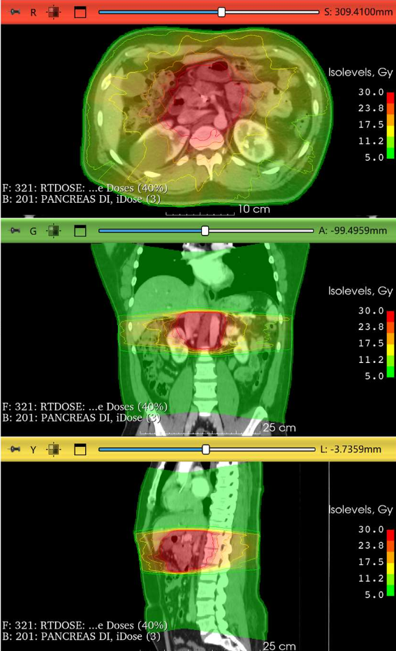

# Projekt2: RT-Viewer

---
## Inhaltsverzeichnis
- [Aufgabenstellung](#aufgabenstellung)
  - [Todo Liste](#todo-liste)
  - [Folie](#folie)
- [Planung](#planung)
  - [Initial](#initial)
  - [Erste Implementierungen](#erste-implementierungen)
- [Shell Commands](#shell-commands)

---
## Aufgabenstellung

### Todo Liste

- [x] Anzeige als orthogonale MPR 
- [x] HU-Einstellfenster
- [ ] Anzeige einer Liste alle Strukturen mit DICOM-Metadaten
- [ ] An-/Ausschalten der Strukturen (aus RT-Structure-Set)
- [ ] Dosisanzeige als transparente Colourwash 
  - [ ] Isolinien
  - [ ] Legende
- [ ] Anzeige der Dosis Min/Max/Mean einer Schicht
- [ ] aktuelle Dosis Maus über Bild

### Folie

<table>
<tr>
<th style="text-align:left;"> 
Gegeben:

DICOM Radiotherapy Datensätze mit

- Planungs-Daten (CT, MRT, CB-CT)
- RT-Dose und RT-Structure-Set

Anforderungen:
- Anzeige als orthogonale MPR + HU-Einstellfenster
- Anzeige einer Liste alle Strukturen mit DICOM-Metadaten
- An-/Ausschalten der Strukturen (aus RT-Structure-Set)
- Dosisanzeige als transparente Colourwash bzw. Isolinien + Legende
- Anzeige der Dosis Min/Max/Mean einer Schicht + aktuelle Dosis Maus über Bild
 
Herausforderungen:

- Radiotherapy Daten analysieren und auswerten
- Strukturen in orthogonalen MPRs anzeigen</th>
<th>  </th>
</tr>
</table>


---
## Planung

### Initial

Erste Idee wie der Code strukturiert sein soll:
````mermaid
---
config:
  theme: 'default'
---
classDiagram
    class BilderHandler{
        - dcm_list: list[str]
        + calc_volume(dcm_list)
        + calc_voxel_spacing()
        + update()
    }
    BilderHandler --> main
    class main{
        + daten_plotten
        + klasse_aufrufen
    }
````

### Erste Implementierungen
````mermaid
---
config:
  theme: 'default'
---
classDiagram
    class DicomHandler{
        - _dicom_list: list[FileDataset]
        + dcm_data_dir: str
        - _get_dcm_files()
        - _sort_dicom_list()
        + create_ct_volume()
        + get_voxelspacing()
        + get_modality()
    }
    class CTViewer{
        + volume: shape
        + dx: float
        + dy: float
        + dz: float
        + x_idx: int
        + y_idx: int
        + z_idx: int
        - _create_figure()
        - _create_images()
        - _create_sliders()
        - _update()
        + show()
        + change_cmap()
        + change_interpolation()
    }
    DicomHandler --> main
    CTViewer --> main
````
---
## Shell Commands:

````shell
pip install -r .\requirements.txt
````

````shell
# create virtual enviroment /.venv :
python3 -m venv .venv

#activate virtual enviroment:
source .venv/bin/activate
````
